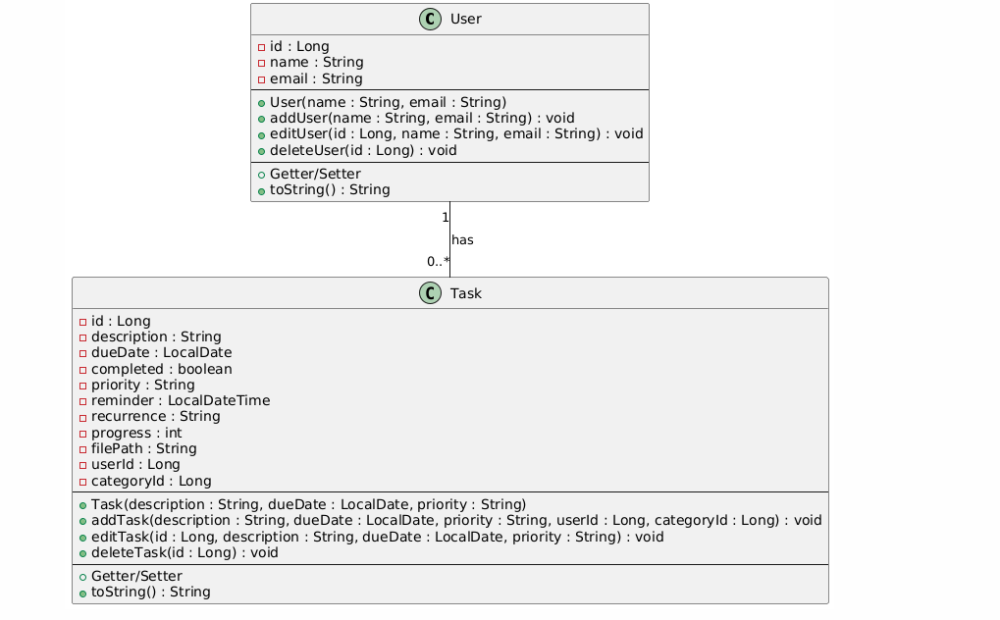

# Anakin 

Aufgabenverwaltungsanwendung – Projektdokumentation

1. Einleitung

Dieses Projekt ist eine Aufgabenverwaltungsanwendung, die es ermöglicht, Benutzer und Aufgaben effizient zu verwalten. Die Anwendung nutzt Vaadin-Flow für das Frontend und Spring Boot für das Backend. Aufgaben können Benutzern zugewiesen, kategorisiert und mit Eigenschaften wie Priorität, Fälligkeitsdatum und Fortschritt versehen werden.

2. UML-Diagramm

2.1 ER-Diagramm

Hier wird die Datenbankstruktur dargestellt, einschließlich der Relationen zwischen den Tabellen.

2.2 Klassendiagramm

Das UML-Klassendiagramm zeigt die wichtigsten Entitäten, ihre Attribute und Methoden.

3. Technologie-Stack

Frontend: Vaadin Flow (Java-basiertes Web-Framework)

Backend: Spring Boot mit Spring Data JPA

Datenbank: H2 (dateibasierte DB für einfache Nutzung)

Persistenz: Hibernate (JPA zur ORM-Verwaltung)

Build-Management: Maven

4. Funktionalitäten

Die Aufgabenverwaltungsanwendung bietet folgende Kernfunktionen:

4.1 Benutzerverwaltung

Anlegen, Bearbeiten und Löschen von Benutzern

Benutzer können Aufgaben zugewiesen werden

4.2 Aufgabenmanagement

Erstellung, Bearbeitung und Löschung von Aufgaben

Aufgaben können einer Kategorie und einem Benutzer zugewiesen werden

Fortschrittsverfolgung für jede Aufgabe

Fälligkeitsdatum, Priorität und Erinnerungen verwalten

Unterstützung für wiederkehrende Aufgaben

Datei-Anhänge für Aufgaben (Dateipfad gespeichert)

4.3 Kategorisierung

Erstellung von Kategorien zur Organisation der Aufgaben

Jede Aufgabe gehört zu einer Kategorie

4.4 Benutzerfreundliche Oberfläche mit Vaadin

Grid-View: Anzeige aller Aufgaben mit Sortierung und Filtermöglichkeiten

Edit-View: Formularbasierte Bearbeitung von Aufgaben

Navigation: Strukturierte Steuerung zwischen verschiedenen Ansichten

5. Datenbankstruktur

Die Anwendung besteht aus folgenden Tabellen:

User: Enthält Informationen zu Benutzern (Name, E-Mail)

Task: Speichert Aufgaben mit ihren Eigenschaften

Category: Organisiert Aufgaben in verschiedene Kategorien

Jede Aufgabe ist mit einem Benutzer und einer Kategorie verknüpft (1:n-Beziehung).

6. CRUD-Operationen und Views

6.1 Grid-View

Anzeige aller Datensätze in einem Grid

Aktionen: Bearbeiten, Löschen

Mehrfachauswahl mit Löschmöglichkeit

Umgang mit Fremdschlüsselabhängigkeiten beim Löschen

6.2 Create/Edit-View

Erfassen und Bearbeiten von Datensätzen über ein Formular

Speicherung der Daten in der Datenbank

Möglichkeit zum Abbrechen (Rückkehr zur Grid-View)

6.3 Zuordnungs-View

1:n-Zuordnung von Datensätzen (z. B. Aufgaben zu Benutzern)

Möglichkeit zur Löschung bestehender Zuordnungen
